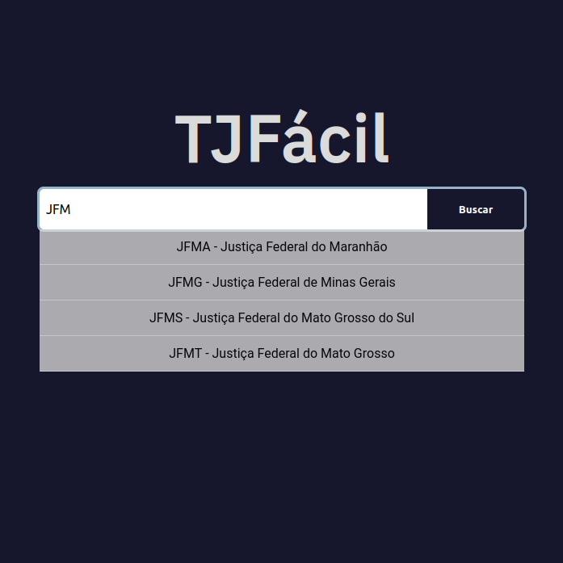

# TJFácil

Um app que redireciona os usuários para as páginas dos tribunais brasileiros.



## Uso

Usuários podem utilizar a barra de busca para pesquisar pela sigla dos tribunais brasileiros ou pelo número de processos judiciais no formato CNJ. Ao buscar pela sigla do tribunal, o usuário é redirecionado para o site principal do tribunal buscado. Ao buscar por um número de processo, o usuário é redirecionado para a página de busca processual do tribunal competente.

## API

Os dados utilizados para o redirecionamento, entre outros dados referentes a tribunais brasileiros, são disponibilizados na [TribunaisAPI](https://github.com/tjfacil/TribunaisAPI).

## Desenvolvimento

```
npm start
npm test
```
